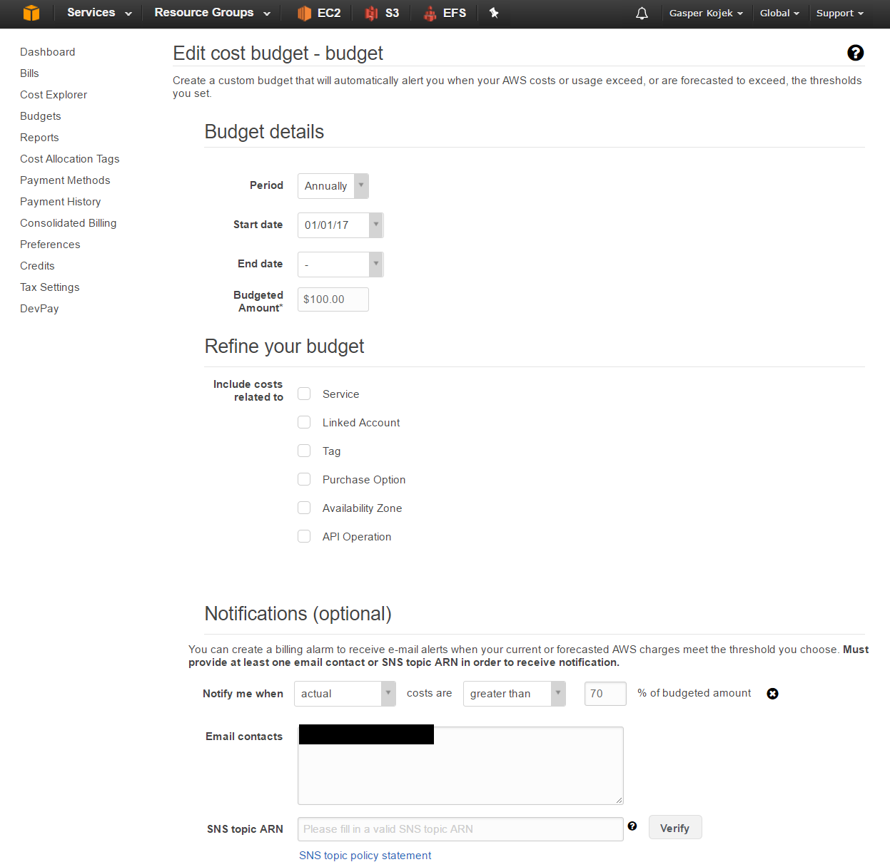

# AWS

Helpful links: 

* [CLI reference](http://docs.aws.amazon.com/cli/latest/reference/)

## 1. Configuration ##

## Make the budget



### Configure AWS CLI
```
aws configure

AWS Access Key ID [****************4237]:
AWS Secret Access Key [****************Y1mr]:
Default region name [eu-central-1]:
Default output format [None]:
```

## Create key pair

```
aws ec2 create-key-pair --key-name MyKeyPair --query 'KeyMaterial' --output text | out-file -encoding ascii -filepath MyK
eyPair.pem
```

### Create security group

```
aws ec2 create-security-group --group-name MySg --description "CCSG"
{
    "GroupId": "sg-0eee8465"
}

```

## 2. Create the instance

Check the image if it follows requirements
```
aws ec2 describe-images --image-ids ami-f52bfa9a
{
    "Images": [
        {
            "VirtualizationType": "paravirtual",
            "Name": "amzn-ami-minimal-pv-2017.03.rc-1.20170327-x86_64-s3",
            "Hypervisor": "xen",
            "ImageOwnerAlias": "amazon",
            "ImageId": "ami-f52bfa9a",
            "RootDeviceType": "instance-store",
            "State": "available",
            "BlockDeviceMappings": [],
            "Architecture": "x86_64",
            "ImageLocation": "amzn-ami-eu-central-1/20c6c7a2f174acd6c46f6741dcb762a1a1140f1b7d1584414516094b27a5b889/137112412989/amzn-ami-minimal-pv-2017.03.rc-1.20170327-x86_64.ext4.10g.manifest.xml",
            "KernelId": "aki-931fe3fc",
            "OwnerId": "137112412989",
            "CreationDate": "2017-03-28T01:50:15.000Z",
            "Public": true,
            "ImageType": "machine",
            "Description": "Amazon Linux AMI 2017.03.rc-1.20170327 x86_64 Minimal PV S3"
        }
    ]
}
```

Not yet tested because we didn't get the credits yet from amazon
```
aws ec2 run-instances --image-id ami-f52bfa9a --count 1  --instance-type m3.medium --key-name MyKeyPair --security-groups MySg
```