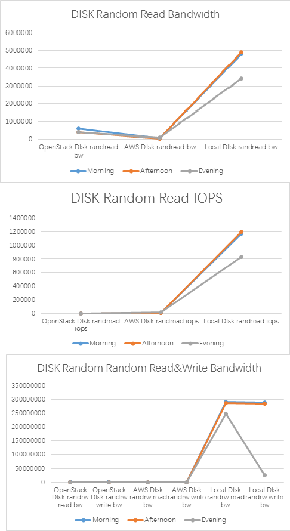
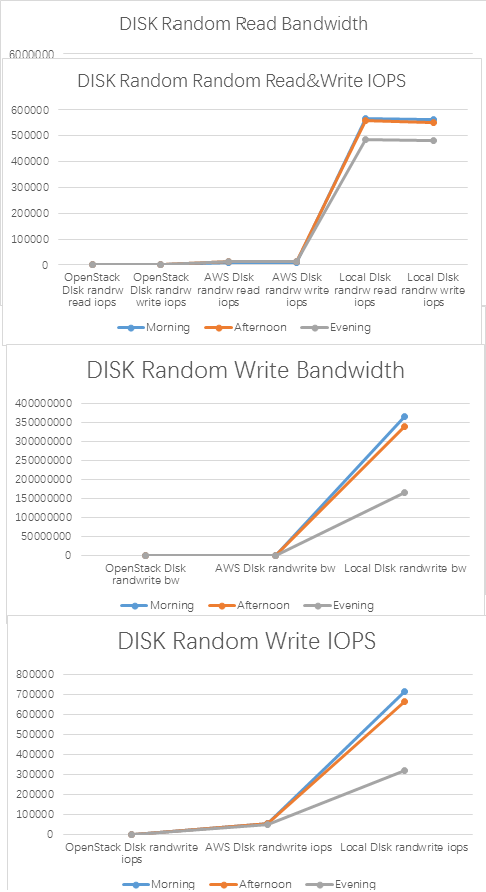
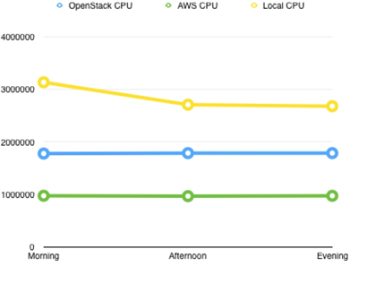
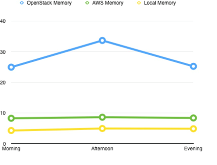

# Assignment 1

## 1. AWS budget, 70% Notifier


*A screenshot showing the budget you created in Amazon AWS that notifies you when you used 70% of your yearly budget.*


## 2. AWS EC2 Setup

### 2.1. Configure AWS CLI
```
$ aws configure

AWS Access Key ID [****************4237]:
AWS Secret Access Key [****************Y1mr]:
Default region name [eu-central-1]:
Default output format [None]:
```

### 2.2. Create key pair

```
$ aws ec2 create-key-pair --key-name MyKeyPair --query 'KeyMaterial' --output text | out-file -encoding ascii -filepath MyK
eyPair.pem
```

### 2.3. Create security group

```
$ aws ec2 create-security-group --group-name MySg --description "CCSG"
{
    "GroupId": "sg-0eee8465"
}

```

### 2.4. Add SSH rule to security group

This will allow SSH traffic from any IP.

```
$ aws ec2 authorize-security-group-ingress --group-name MySg --protocol tcp --port 22 --cidr 0.0.0.0/0

```

### 2.5. Check the image if it follows requirements

```
$ aws ec2 describe-images --image-ids ami-f52bfa9a
{
    "Images": [
        {
            "VirtualizationType": "paravirtual",
            "Name": "amzn-ami-minimal-pv-2017.03.rc-1.20170327-x86_64-s3",
            "Hypervisor": "xen",
            "ImageOwnerAlias": "amazon",
            "ImageId": "ami-f52bfa9a",
            "RootDeviceType": "instance-store",
            "State": "available",
            "BlockDeviceMappings": [],
            "Architecture": "x86_64",
            "ImageLocation": "amzn-ami-eu-central-1/20c6c7a2f174acd6c46f6741dcb762a1a1140f1b7d1584414516094b27a5b889/137112412989/amzn-ami-minimal-pv-2017.03.rc-1.20170327-x86_64.ext4.10g.manifest.xml",
            "KernelId": "aki-931fe3fc",
            "OwnerId": "137112412989",
            "CreationDate": "2017-03-28T01:50:15.000Z",
            "Public": true,
            "ImageType": "machine",
            "Description": "Amazon Linux AMI 2017.03.rc-1.20170327 x86_64 Minimal PV S3"
        }
    ]
}
```

It does, so we can create the instance

### 2.6. Create and run the instance

```
$ aws ec2 run-instances --image-id ami-f52bfa9a --count 1  --instance-type m3.medium --key-name MyKeyPair --security-groups MySg
```

### 2.7. SSH into instance: 

* default user on Amazon AMI insatnces is `ec2-user`
* to get the IP address of the instance, run `aws ec2 describe-instances` command and copy the value under `PublicDnsName` - you can also add `| grep "PublicDnsName"` to get just the public IP

```
$ aws ec2 describe-instances --instance-ids  i-0f7869d58c8c6b8f2 | grep "PublicDnsName"
                                        "PublicDnsName": "ec2-52-59-152-59.eu-central-1.compute.amazonaws.com",
                                "PublicDnsName": "ec2-52-59-152-59.eu-central-1.compute.amazonaws.com",
                    "PublicDnsName": "ec2-52-59-152-59.eu-central-1.compute.amazonaws.com",
```

```
$ ssh -i MyKeyPair.pem ec2-user@ec2-52-59-152-59.eu-central-1.compute.amazonaws.com
The authenticity of host 'ec2-52-59-152-59.eu-central-1.compute.amazonaws.com (52.59.152.59)' can't be established.
ECDSA key fingerprint is SHA256:qUd2NfLrtvUZYlFW2uSUzoGsxZE+gaXhVC6Na+13eKc.
Are you sure you want to continue connecting (yes/no)? yes
Warning: Permanently added 'ec2-52-59-152-59.eu-central-1.compute.amazonaws.com,52.59.152.59' (ECDSA) to the list of known hosts.

       __|  __|_  )
       _|  (     /   Amazon Linux AMI
      ___|\___|___|

https://aws.amazon.com/amazon-linux-ami/2017.03-release-notes/

```
### 2.8. Set up instance with needed tools

```
$ sudo yum update -y && sudo yum install -y gcc fio git vim aws-apitools-ec aws-amitools-ec2 openssh-clients
```

* Also, clone our repository which holds the benchmark scripts

```
$ git clone https://github.com/ribafish/cloudcomputing.git
```

### 2.9. Run benchmarks (multiple times)

```
$ ./perform_tests.sh 
Performing CPU Benchmark ...
Performing Memory Benchmark ...
Performing Disk Benchmark ...
  - seq read
  - seq write
  - seq read & write
  - rand read
  - rand write
  - rand read & write

```

### 2.10. Terminate instance

```
aws ec2 terminate-instances --instance-ids i-0f7869d58c8c6b8f2
{
    "TerminatingInstances": [
        {
            "PreviousState": {
                "Code": 16,
                "Name": "running"
            },
            "InstanceId": "i-00aa2dd827fd6af2f",
            "CurrentState": {
                "Code": 32,
                "Name": "shutting-down"
            }
        }
    ]
}
```


## 3. VM in OpenStack setup

### 3.1  Configuration

Download and source the OpenStack RC file

```
$ . cc17-group06-openrc.sh
```

Load parameters into the environment

```
$ source openrc
```

### 3.2 Import a key pair named 'group06key'

```
$ openstack keypair create --public-key group06key.pub keyPair
ssh passphrase:group06
```

### 3.3 Allow SSH to the intances and allow pinging of the instances

```
$ openstack security group rule create default \--protocol tcp --dst-port 22:22 --remote-ip 0.0.0.0/0
$ openstack security group rule create --protocol icmp \ default
```

### 3.4 Launch an instance

```
$ openstack server create --flavor 604de11c-3222-4902-8523-11cc61b5b485 --image 11f6b8aa-31df-4b66-8b42-5ee9760c47ba --key-name group06key --security-group default proj1
```

### 3.5 Assign a floating IP to the instance

```
$ openstack server add floating ip proj1 10.12.1.215
```

### 3.6 Log in via ssh

```
$ ssh -i group06key.key ubuntu@10.200.2.117
```

### 3.7 Set up VM with needed tools

```
$ sudo apt-get update
$ sudo apt install yum
$ sudo yum install libaio-devel
$ sudo apt-get install fio
$ sudo apt-get install gcc
```

### 3.8 Run benchmarks

```
$ ./linpack.sh
$ ./memsweep.sh
$ ./perform_tests.sh 
Performing CPU Benchmark ...
Performing Memory Benchmark ...
Performing Disk Benchmark ...
  - seq read
  - seq write
  - seq read & write
  - rand read
  - rand write
  - rand read & write
```

## 4. Benchmarks

### Disk benchmarks





1. Look at the disk measurements. Are they consistent with your expectations. If not, what could be the reason?

The disk measurements display show a consistent behaviour on all instances.

2. Based on the comparison with the measurements on your local hard drive, what kind of storage solutions do you think the two clouds use?


### CPU benchmarks


*The plot created on the data created by the given benchmarks*

1. Look at linpack.sh and linpack.c and shortly describe how the benchmark works.

The linpack.sh script checks if the benchmarking software is compiled or compiles the code in linpack.c with GCC. The compiled code is run and the result printed. The linpack.c defines a collection of computing methods to benchmark a system. The methods solve mathematical problems and the benchmark is counting the number of 64-bit floating-point operations the system can perform per second, also known as FLOPS. The variable arsize defines the multiplicator of FLOPS and is set to 1000 so the benckmark calculates KFLOPS. An approximation of the needed Memory is created and used to decide if the benchmark is possible. The variable ops defines the number of operations to be  2/3n³ + 2n². The method linpack runs three functions. matgen() creates a matrix, dgefa() creates a double precision system based on the created matrix by using the gaussian elimination and dgesl solves the double precision system. The process is repeated until 10 seconds passed. The number of KFLOPS is created by following formula kflops=2.*nreps*ops/(1000.*(tdgefa+tdgesl)).

2. Find out what the LINPACK benchmark measures. Would you expect paravirtualization to affect the LINPACK benchmark? Why?

The LINPACK benchmark measures the peak performance of a system by defining FLOPS. FLOPS are the number of Floating Point Operations Per Second a system can run. LINPACK solves a linear equations to measure the performance. Since the calculations are based on unprivileged instructions the results of the LINPACK benchmark shouldnt be affected by using paravirtualization.


3. Look at your LINPACK measurements. Are they consistent with your expectations? If not, what could be the reason? 

The created benchmarks show a very steady performance on the OPENSTACK and AWS instances. A hosted instances the results perform like our expectations. The LOCAL PC had a slight strong performance which is understandable. 


### Memory benchmarks


*The plot created on the data created by the given benchmarks.*


1. Find out how the memsweep benchmark works by looking at the shell script and the C code. Would you expect virtualization to affect the memsweep benchmark? Why?

The memsweep.sh script checks if the benchmarking software is compiled or compiles the code in linpack.c with GCC. The compiled code is run and the result printed. The memsweep benchmark measures the time the systems needs to fill mallocated array with the size 8096 * 4096 and then to clear the memory again.0
A virtualization wont have any effects on the memsweep benchmark. The malloc() functions is using the heap to allocate a block of memory and wont have access to virtual memory.

2. Look at your memsweep measurements. Are they consistent with your expectations. If not, what could be the reason?

The measurements seem to have reasonable results since LOCAL PC and AWS return steady values. The openstack memory shows a increase during the day. 

