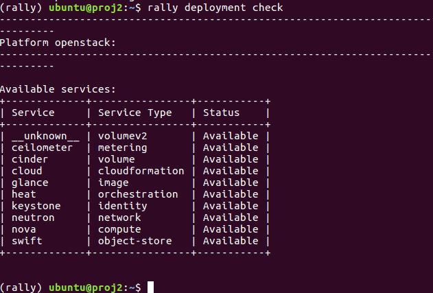
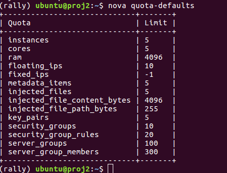
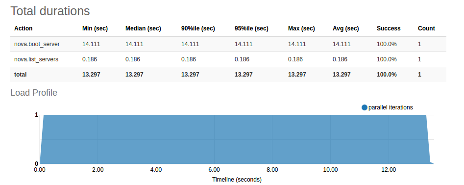
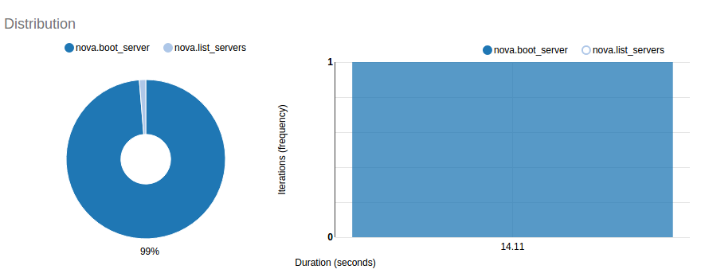
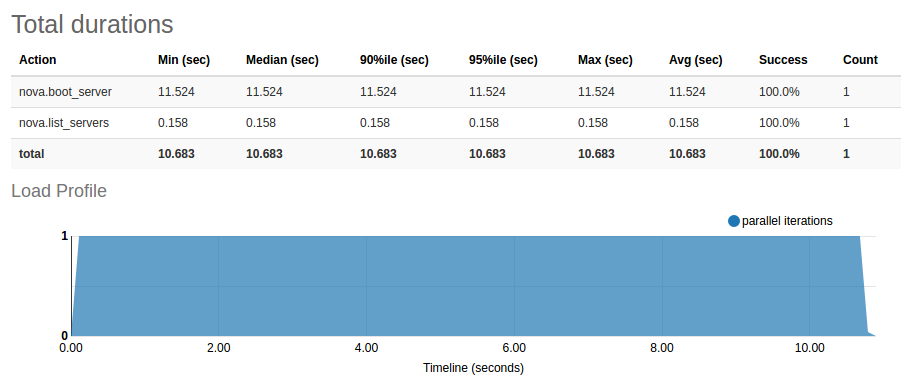
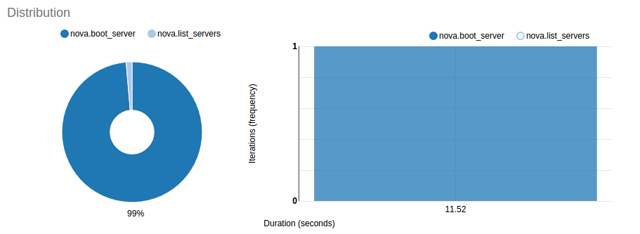
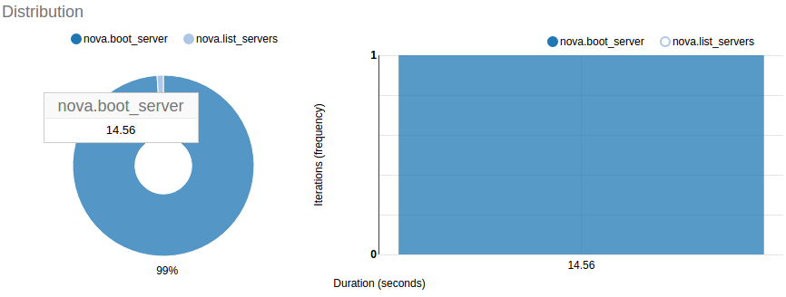
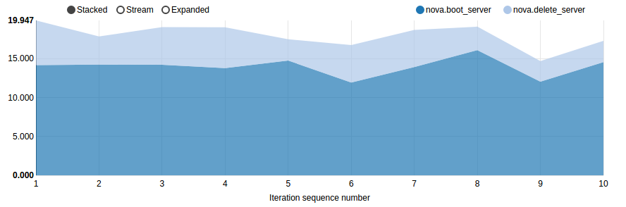
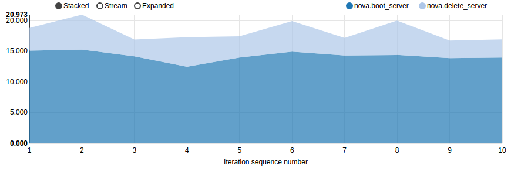
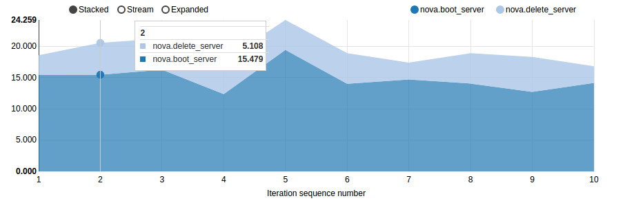

# Cloud Computing Assignment 2

**Group 06:**

* Gasper Kojek
* Jens Klein
* Leo Li
* Jinhu
* Tongli

## Task 1: Cloud Benchmark

### Prerequisites

Install dependencies and Rally

```shell
$ sudo apt-get update

# Install libraries which Rally needs
$ sudo apt-get install libssl-dev libffi-dev python-dev libxml2-dev libxslt1-dev libpq-dev git python-pip

# Install Rally
$ wget -q -O-https://raw.githubusercontent.com/openstack/rally/master/install_rally.sh | bash
```

### Deploy Rally

```shell
# enable Rally virtual environment
$ . /home/ubuntu/rally/bin/activate

# provide Rally with an OpenStack deployment it is going to benchmark
$ . cc17-group06-openrc.sh

# registering existing users in Rally
$ rally deployment create --file group06.json --name group06cloud

# check if deployment is availble
$ rally deployment check
```



group06.json file:

```json
{
    "type": "ExistingCloud",
    "auth_url": "http://cloud.cit.tu-berlin.de:5000/v2.0",
    "region_name": "RegionOne",
    "endpoint_type": "public",
    "users": [
        {
            "username": "cc17-group06",
            "password": groupPassword,
            "tenant_name": "cc17-group06"
        }
    ]
}
```

Check quota of Openstack project



### Run Benchmark

```shell
# Run benchmark for scenario "Querying the list of your VMs"
$ rally task start boot-and-list.json
# generate report according to the task id
$ rally task report 969ef742-ee42-4552-be25-03b0b17a11e1 --out boot-and-list_output.html

# Run benchmark for scenario "Creatioin time of VMs"
$ rally task start boot-and-delete.json
# generate report according to the task id
$ rally task report 525de43c-c7fc-4b99-8572-4d274fbd4c72 --out boot-and-delete_output.html
```

(If a task is executed in different time, its id will change)

### Benchmark Scripts and Descriptions

####  For scenario "Querying the list of your VMs" 

boot-and-list.json

Rally launches benchmark scenarios via benchmark task configuration files. To run 'boot-and-list.json', firstly set the flavor_name same with the flavor_name of OpenStack project, namely "Cloud Computing", then set the image name as "ubuntu-16.04", and delete contents in "context" because we don't have admin roles and need to run benchmark as existing users. 

This benchmark is to boot a server from an image and then list all servers.

```json

{
    "NovaServers.boot_and_list_server": [
        {
            "args": {
                "flavor": {
                    "name": "{{flavor_name}}"
                },
                "image": {
                    "name": "ubuntu-16.04"
                },
                "detailed": true
            },
            "runner": {
                "type": "constant",
                "times": 1,
                "concurrency": 1
            },
            "context": {
                
            }
        }
    ]
}
```

####  For scenario "Creation time of VMs"

'boot-and-delete.json'

Parameters 'flavor_name', 'name' in image' and 'context' were set as same as mentioned before.

This benchmark has several atomic actions, namely boot VM and delete VM.  Inside each scenario of this configuration, the benchmark scenario is launched 10 times, which is specified in "runner". The "type" parameter value "constant" in "runner" is for creating a constant load by running the scenario for a fixed number of times.

```json

{
    "NovaServers.boot_and_delete_server": [
        {
            "args": {
                "flavor": {
                    "name": "{{flavor_name}}"
                },
                "image": {
                    "name": "ubuntu-16.04"
                },
                "force_delete": false
            },
            "runner": {
                "type": "constant",
                "times": 10,
                "concurrency": 2
            },
            "context": {
            }
        },
        {
            "args": {
                "flavor": {
                    "name": "{{flavor_name}}"
                },
                "image": {
                    "name": "ubuntu-16.04"
                },
                "auto_assign_nic": true
            },
            "runner": {
                "type": "constant",
                "times": 10,
                "concurrency": 2
            },
            "context": {
                
            }
        }
    ]
}
```

### Benchmark Results

#### For scenario "Querying the list of your VMs"

Morning at 11:30





Afternoon at 13:30





Night at 20:30




In morning and evening, it will take more time to boot a server from a images, more than 14 seconds in the morning and evening, in the afternoon is less than 12 seconds. The time for listing server is always less than 0.2 seconds, but in the morning it will take a little more.

#### For scenario "Creation time of VMs"

Morning at 11:30



Afternoon at 13:30



Night at 20:30



From these three graphs, time for booting server is around 15 seconds, delete servers takes about 4 to 6 seconds. 

##  Task 2: Introducing Heat

### Prerequisites

- access to CIT Cloud (see previous assignment)
- open VPN connection to TU


### Creation script

In order to keep cli commands short we put the openstack cli command in a shell script - `create-stack.sh`:

```
openstack stack create -t material/server.yml assignment2-task2-stack \
--parameter "name=assignment2-task2-vm" \
--parameter "key_pair=group06key" \
--parameter "flavor=Cloud Computing" \
--parameter "image=ubuntu-16.04" \
--parameter "zone=Cloud Computing 2017" \
--parameter "network=cc17-net"
```

### Executing the heat client script

Just run: 

```
./create-stack.sh
```

### Test if successful

#### Assign floating IP address

```
openstack server add floating ip assignment2-task2-vm 10.200.2.251
```

#### SSH into instance

```
ssh -i ~/.ssh/open_stack ubuntu@10.200.2.251
```

where `~/.ssh/open_stack` is the private key of the assigned key pair

#### From the instance check internet connectivity with ping

```
ping google.de
```

Output:

```
PING google.de (172.217.17.131) 56(84) bytes of data.
64 bytes from ams15s30-in-f131.1e100.net (172.217.17.131): icmp_seq=1 ttl=56 time=15.6 ms
^C
--- google.de ping statistics ---
1 packets transmitted, 1 received, 0% packet loss, time 0ms
rtt min/avg/max/mdev = 15.633/15.633/15.633/0.000 ms
```

"1 packets transmitted" - Indicating we can reach googles server.

### Delete Stack

Delete stack via CLI:

```
openstack stack delete assignment2-task2-stack -y
```

Check deleted instances:

```
openstack stack list --deleted --property "name=assignment2-task2-stack" -c "Stack Name" -c "Stack Status"
```

Output:

```
+-------------------------+-----------------+
| Stack Name              | Stack Status    |
+-------------------------+-----------------+
| assignment2-task2-stack | DELETE_COMPLETE |
+-------------------------+-----------------+
```

## Task 3: Advanced Heat templates

### Template files

#### Creation script
In order to keep cli commands short we put the openstack cli command in a shell script  `create-stack3.sh`:

```
openstack stack create -t server-landscape.yaml assignment2-task3-stack \
--parameter "name=assignment2-task3-vm" \
--parameter "router=cc17-23-router" \
--parameter "server=cc17-23-server" \
--parameter "network=cc17-23-net"	\
--parameter "subnet=cc17-23-subnet" \
--parameter "key_pair=group06key" \
--parameter "network_public=tu-internal"
```

#### Top heat file

 `server-landscape.yaml`:
 
 ```
 heat_template_version: 2015-10-15
description: Three VM instances

parameters:

    name:
        type: string
        label: Name of the VM

    router:
        type: string
        label: Name of the Router    

    server:
        type: string
        label: Name of the Server

    network:
        type: string
        label: Name of the Network

    subnet:
        type: string
        label: Name of the Subnet

    key_pair:
        type: string
        label: Key Pair
        constraints:
            - custom_constraint: nova.keypair

    network_public:
        type: string
        label: Network
        constraints:
            - custom_constraint: neutron.network

    backend_servers:
        type: string
        label: Number of backend servers
        default: 2

resources:

    private_net : 
        type : OS::Neutron::Net
        description: Private network
        properties : 
            name : { get_param: network }

    private_subnet:
        type: OS::Neutron::Subnet
        description: Private subnet
        properties:
            name: { get_param: subnet }
            network_id: { get_resource: private_net }
            cidr: 10.12.2.0/24
            allocation_pools: 
                - start: 10.12.2.2
                  end: 10.12.2.254

    ssh_ping_security:
        type: OS::Neutron::SecurityGroup
        properties:
            name: ssh_ping_security
            description: Ping and SSH
            rules:
                - protocol: icmp
                - protocol: tcp
                  remote_ip_prefix: 0.0.0.0/0
                  port_range_min: 22
                  port_range_max: 22
                - protocol: tcp
                  port_range_min: 5000
                  port_range_max: 5000

    http_security:
        type: OS::Neutron::SecurityGroup
        properties:
            name: http_security
            description: HTTP
            rules:
                - protocol: icmp
                - protocol: tcp
                  remote_ip_prefix: 0.0.0.0/0
                  port_range_min: 80
                  port_range_max: 80

      
    router1:
        type: OS::Neutron::Router
        description: External router
        properties:
            name: { get_param: router }
            external_gateway_info:
                network: { get_param: network_public }
           

    router1_interface:
        type: OS::Neutron::RouterInterface
        description: Interface between external router and private subnet
        properties:
            router_id: { get_resource: router1 }
            subnet: { get_resource: private_subnet }


    frontend_floating_ip:
        type: OS::Neutron::FloatingIP
        description: External floating ip
        properties:
            floating_network: { get_param: network_public }
            port_id: { get_attr: [frontend, port] }


    frontend:
        type: server.yaml
        properties:
            key_pair: { get_param: key_pair }
            flavor: Cloud Computing
            availability_zone: Cloud Computing 2017
            image: ubuntu-16.04
            security_groups: [{get_resource: ssh_ping_security}, {get_resource: http_security}]
            private_net: { get_resource: private_net }
            name: 
                str_replace:
                    template: $srv-Front
                    params: 
                        $srv: {get_param : server}
            subnet: {get_resource: private_subnet }              

    backedGroup:
        type: OS::Heat::ResourceGroup
        properties:
            count: { get_param: backend_servers}
            resource_def:
                type: server.yaml
                properties:
                    key_pair: { get_param: key_pair }
                    flavor: Cloud Computing
                    availability_zone: Cloud Computing 2017
                    image: ubuntu-16.04
                    security_groups: [{ get_resource: ssh_ping_security }] 
                    private_net: { get_resource: private_net }
                    name: 
                        str_replace:
                            template: $srv-Back-%index%
                            params: 
                                $srv: {get_param : server}
                    subnet: {get_resource: private_subnet }
        

outputs:
    floating_ip:
        description: The floating ip
        value: { get_attr: [frontend_floating_ip, floating_ip_address] }

 ```
  
 #### Nested stack heat template
 
 `server.yaml`:
 
 ```
	heat_template_version: 2015-10-15
	description: Server template

	parameters:

	    flavor:
		type: string
		label: Flavor
		constraints:
		    - custom_constraint: nova.flavor

	    availability_zone: 
		type: string
		label: Availability Zone
		default: Default


	    image:	
		type: string
		label: Image Name
		constraints:
		    - custom_constraint: glance.image

	    name:
		type: string
		label: Name of the Server
	    

	    key_pair:
		type: string
		label: Key Pair
		constraints:
		    - custom_constraint: nova.keypair

	    security_groups: 
		type: comma_delimited_list 
		label: Security Group(s) 
		default: [default]

	    private_net:
		type: string

	    subnet:
		type: string
		description: subnet for the instance

	resources:

	    server_port:
		type: OS::Neutron::Port
		properties:
		    name: backend_port
		    network_id: { get_param: private_net }
		    security_groups: {get_param: security_groups}
		    fixed_ips:
		        - subnet_id: {get_param: subnet} 

	    Servertemplate:
		type: OS::Nova::Server
		properties:
		    flavor: {get_param: flavor}
		    key_name: { get_param: key_pair}
		    availability_zone: { get_param: availability_zone}
		    image: {get_param: image}
		    name: {get_param : name}
		    admin_user: ubuntu
		    networks:  [{port: {get_resource: server_port} }]              

	outputs:
	    port:
		description: port
		value: { get_resource: server_port }
 ```
 
 ### Commands used
 
 #### Create stack
 
 ```
 $ ./create-stack3.sh 
+---------------------+--------------------------------------+
| Field               | Value                                |
+---------------------+--------------------------------------+
| id                  | fdc915a8-2730-420c-88f4-29d00744d42d |
| stack_name          | assignment2-task3-stack              |
| description         | Three VM instances                   |
| creation_time       | 2017-07-02T03:51:58                  |
| updated_time        | None                                 |
| stack_status        | CREATE_IN_PROGRESS                   |
| stack_status_reason |                                      |
+---------------------+--------------------------------------+
```

#### Extract the `floating_ip` variable

```
$ openstack stack output show --all assignment2-task3-stack
+-------------+------------------------------------+
| Field       | Value                              |
+-------------+------------------------------------+
| floating_ip | {                                  |
|             |   "output_value": "10.200.2.33",   |
|             |   "output_key": "floating_ip",     |
|             |   "description": "The floating ip" |
|             | }                                  |
+-------------+------------------------------------+
```

#### Test the created VMs

* ssh into Frontend and ping google to test internet connection

```
$ ssh -i group06key.key ubuntu@10.200.2.31
Enter passphrase for key 'group06key.key': 
Welcome to Ubuntu 16.04 LTS (GNU/Linux 4.4.0-22-generic x86_64)
 * Documentation:  https://help.ubuntu.com/
  Get cloud support with Ubuntu Advantage Cloud Guest:
    http://www.ubuntu.com/business/services/cloud
0 packages can be updated.
0 updates are security updates.
Last login: Sun Jul  2 03:41:40 2017 from 130.149.212.179
To run a command as administrator (user "root"), use "sudo <command>".
See "man sudo_root" for details.
ubuntu@cc17-23-server-front:~$ ping google.com
PING google.com (172.217.17.142) 56(84) bytes of data.
64 bytes from ams15s30-in-f14.1e100.net (172.217.17.142): icmp_seq=1 ttl=56 time=15.1 ms
^C
--- google.com ping statistics ---
1 packets transmitted, 1 received, 0% packet loss, time 0ms
rtt min/avg/max/mdev = 15.114/15.114/15.114/0.000 ms
```

* copy our ssh key file to frontend from separate terminal

```
$ scp -i group06key.key group06key.key  ubuntu@10.200.2.33:~
Enter passphrase for key 'group06key.key': 
group06key.key        100% 1766     1.7KB/s   00:00    
```

* ssh from frontend to backend servers and test internet connection from backend (same on both, shown only for first)

```
ubuntu@cc17-23-server-front:~$ ssh -i group06key.key ubuntu@10.12.2.4
The authenticity of host '10.12.2.4 (10.12.2.4)' can't be established.
ECDSA key fingerprint is SHA256:9JvnmM1l5llzQ6NZSbry0XMh8lHG25SI57Eddn9LhJw.
Are you sure you want to continue connecting (yes/no)? yes
Warning: Permanently added '10.12.2.4' (ECDSA) to the list of known hosts.
Enter passphrase for key 'group06key.key': 
Welcome to Ubuntu 16.04 LTS (GNU/Linux 4.4.0-22-generic x86_64)

 * Documentation:  https://help.ubuntu.com/

  Get cloud support with Ubuntu Advantage Cloud Guest:
    http://www.ubuntu.com/business/services/cloud

0 packages can be updated.
0 updates are security updates.


The programs included with the Ubuntu system are free software;
the exact distribution terms for each program are described in the
individual files in /usr/share/doc/*/copyright.

Ubuntu comes with ABSOLUTELY NO WARRANTY, to the extent permitted by
applicable law.

To run a command as administrator (user "root"), use "sudo <command>".
See "man sudo_root" for details.

ubuntu@cc17-23-server-back-1:~$ ping google.com
PING google.com (172.217.17.142) 56(84) bytes of data.
64 bytes from ams15s30-in-f142.1e100.net (172.217.17.142): icmp_seq=1 ttl=56 time=15.2 ms
64 bytes from ams15s30-in-f142.1e100.net (172.217.17.142): icmp_seq=2 ttl=56 time=15.2 ms
^C
--- google.com ping statistics ---
2 packets transmitted, 2 received, 0% packet loss, time 1001ms
rtt min/avg/max/mdev = 15.206/15.232/15.259/0.126 ms
```