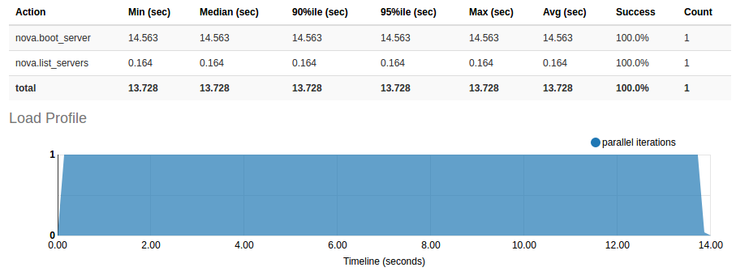

# Task 1: Cloud Benchmark

## Prerequisites

Install dependencies and Rally

```shell
$ sudo apt-get update

# Install libraries which Rally needs
$ sudo apt-get install libssl-dev libffi-dev python-dev libxml2-dev libxslt1-dev libpq-dev git python-pip

# Install Rally
$ wget -q -O-https://raw.githubusercontent.com/openstack/rally/master/install_rally.sh | bash
```

## Deploy Rally

```shell
# enable Rally virtual environment
$ . /home/ubuntu/rally/bin/activate

# provide Rally with an OpenStack deployment it is going to benchmark
$ . cc17-group06-openrc.sh

# registering existing users in Rally
$ rally deployment create --file group06.json --name group06cloud

# check if deployment is availble
$ rally deployment check
```


group06.json file:

```json
{
    "type": "ExistingCloud",
    "auth_url": "http://cloud.cit.tu-berlin.de:5000/v2.0",
    "region_name": "RegionOne",
    "endpoint_type": "public",
    "users": [
        {
            "username": "cc17-group06",
            "password": groupPassword,
            "tenant_name": "cc17-group06"
        }
    ]
}
```

Check quota of Openstack project


## Run Benchmark

```shell
# Run benchmark for scenario "Querying the list of your VMs"
$ rally task start boot-and-list.json
# generate report according to the task id
$ rally task report 969ef742-ee42-4552-be25-03b0b17a11e1 --out boot-and-list_output.html

# Run benchmark for scenario "Creatioin time of VMs"
$ rally task start boot-and-delete.json
# generate report according to the task id
$ rally task report 525de43c-c7fc-4b99-8572-4d274fbd4c72 --out boot-and-delete_output.html
```

(If a task is executed in different time, its id will change)

## Benchmark Scripts and Descriptions

###  For scenario "Querying the list of your VMs" 

boot-and-list.json

Rally launches benchmark scenarios via benchmark task configuration files. To run 'boot-and-list.json', firstly set the flavor_name same with the flavor_name of OpenStack project, namely "Cloud Computing", then set the image name as "ubuntu-16.04", and delete contents in "context" because we don't have admin roles and need to run benchmark as existing users. 

This benchmark is to boot a server from an image and then list all servers.

```json

{
    "NovaServers.boot_and_list_server": [
        {
            "args": {
                "flavor": {
                    "name": "{{flavor_name}}"
                },
                "image": {
                    "name": "ubuntu-16.04"
                },
                "detailed": true
            },
            "runner": {
                "type": "constant",
                "times": 1,
                "concurrency": 1
            },
            "context": {
                
            }
        }
    ]
}
```

###  For scenario "Creation time of VMs"

'boot-and-delete.json'

Parameters 'flavor_name', 'name' in image' and 'context' were set as same as mentioned before.

This benchmark has several atomic actions, namely boot VM and delete VM.  Inside each scenario of this configuration, the benchmark scenario is launched 10 times, which is specified in "runner". The "type" parameter value "constant" in "runner" is for creating a constant load by running the scenario for a fixed number of times.

```json

{
    "NovaServers.boot_and_delete_server": [
        {
            "args": {
                "flavor": {
                    "name": "{{flavor_name}}"
                },
                "image": {
                    "name": "ubuntu-16.04"
                },
                "force_delete": false
            },
            "runner": {
                "type": "constant",
                "times": 10,
                "concurrency": 2
            },
            "context": {
            }
        },
        {
            "args": {
                "flavor": {
                    "name": "{{flavor_name}}"
                },
                "image": {
                    "name": "ubuntu-16.04"
                },
                "auto_assign_nic": true
            },
            "runner": {
                "type": "constant",
                "times": 10,
                "concurrency": 2
            },
            "context": {
                
            }
        }
    ]
}
```

## Benchmark Results

### For scenario "Querying the list of your VMs"

Morning at 11:30


Afternoon at 13:30


Night at 20:30




In morning and evening, it will take more time to boot a server from a images, more than 14 seconds in the morning and evening, in the afternoon is less than 12 seconds. The time for listing server is always less than 0.2 seconds, but in the morning it will take a little more.

### For scenario "Creation time of VMs"

Morning at 11:30


Afternoon at 13:30


Night at 20:30


From these three graphs, time for booting server is around 15 seconds, delete servers takes about 4 to 6 seconds. 

#  Task 2: Introducing Heat

## Prerequisites

- access to CIT Cloud (see previous assignment)
- open VPN connection to TU


## Creation script

In order to keep cli commands short we put the openstack cli command in a shell script - `create-stack.sh`:

```
openstack stack create -t material/server.yml assignment2-task2-stack \
--parameter "name=assignment2-task2-vm" \
--parameter "key_pair=group06key" \
--parameter "flavor=Cloud Computing" \
--parameter "image=ubuntu-16.04" \
--parameter "zone=Cloud Computing 2017" \
--parameter "network=cc17-net"
```

## Executing the heat client script

Just run: 

```
./create-stack.sh
```

## Test if successful

### Assign floating IP address

```
openstack server add floating ip assignment2-task2-vm 10.200.2.251
```

### SSH into instance

```
ssh -i ~/.ssh/open_stack ubuntu@10.200.2.251
```

where `~/.ssh/open_stack` is the private key of the assigned key pair

### From the instance check internet connectivity with ping

```
ping google.de
```

Output:

```
PING google.de (172.217.17.131) 56(84) bytes of data.
64 bytes from ams15s30-in-f131.1e100.net (172.217.17.131): icmp_seq=1 ttl=56 time=15.6 ms
^C
--- google.de ping statistics ---
1 packets transmitted, 1 received, 0% packet loss, time 0ms
rtt min/avg/max/mdev = 15.633/15.633/15.633/0.000 ms
```

"1 packets transmitted" - Indicating we can reach googles server.

## Delete Stack

Delete stack via CLI:

```
openstack stack delete assignment2-task2-stack -y
```

Check deleted instances:

```
openstack stack list --deleted --property "name=assignment2-task2-stack" -c "Stack Name" -c "Stack Status"
```

Output:

```
+-------------------------+-----------------+
| Stack Name              | Stack Status    |
+-------------------------+-----------------+
| assignment2-task2-stack | DELETE_COMPLETE |
+-------------------------+-----------------+
```

